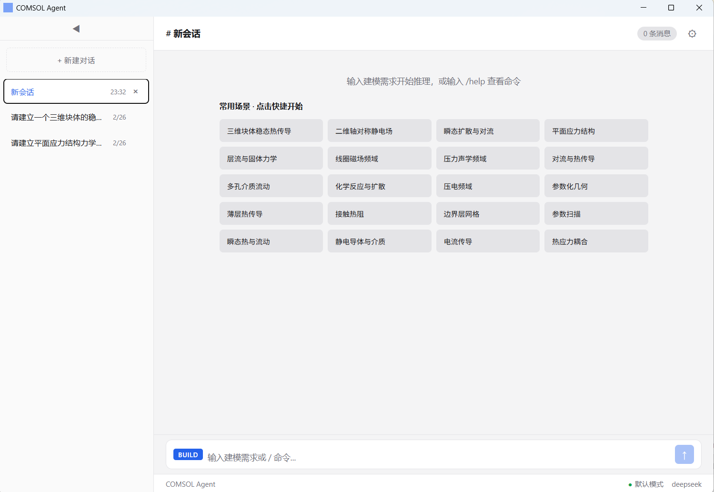
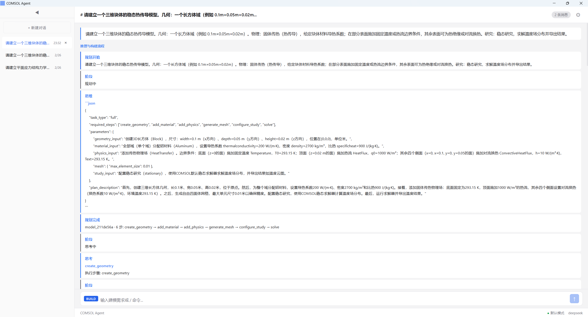
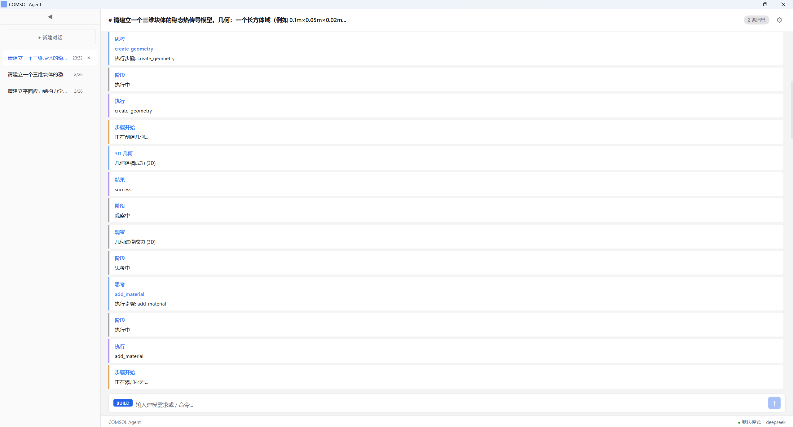
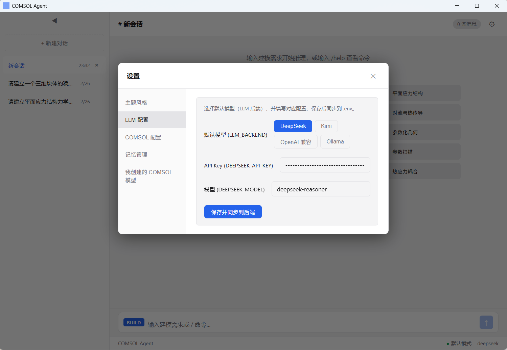
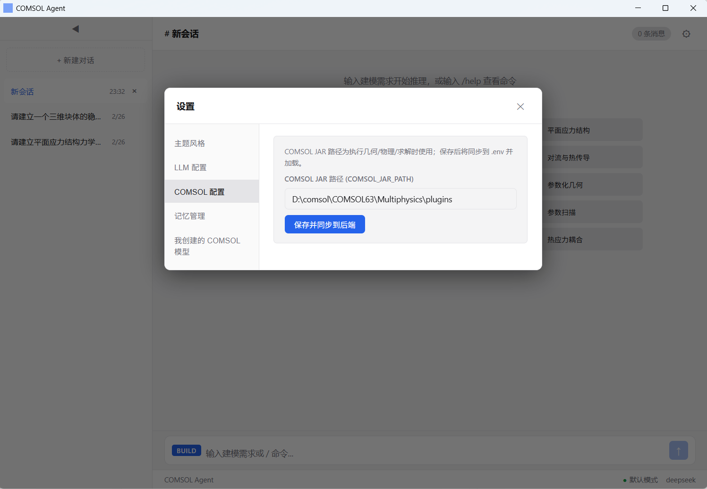
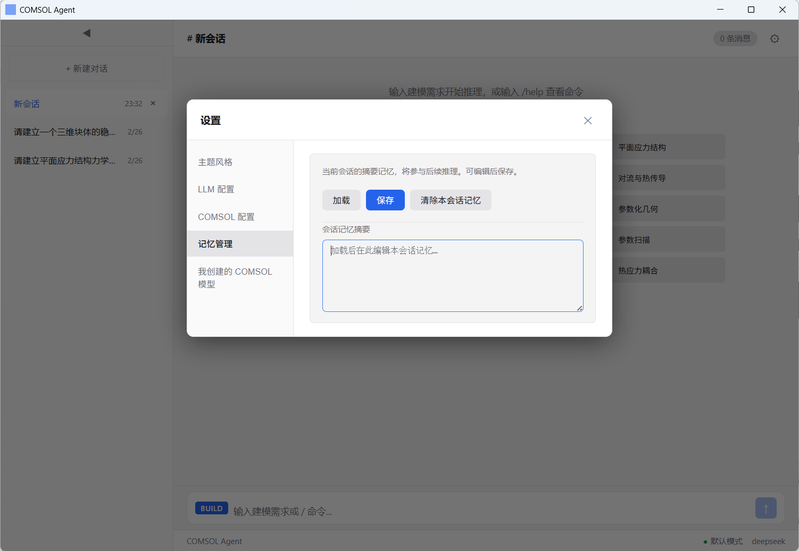
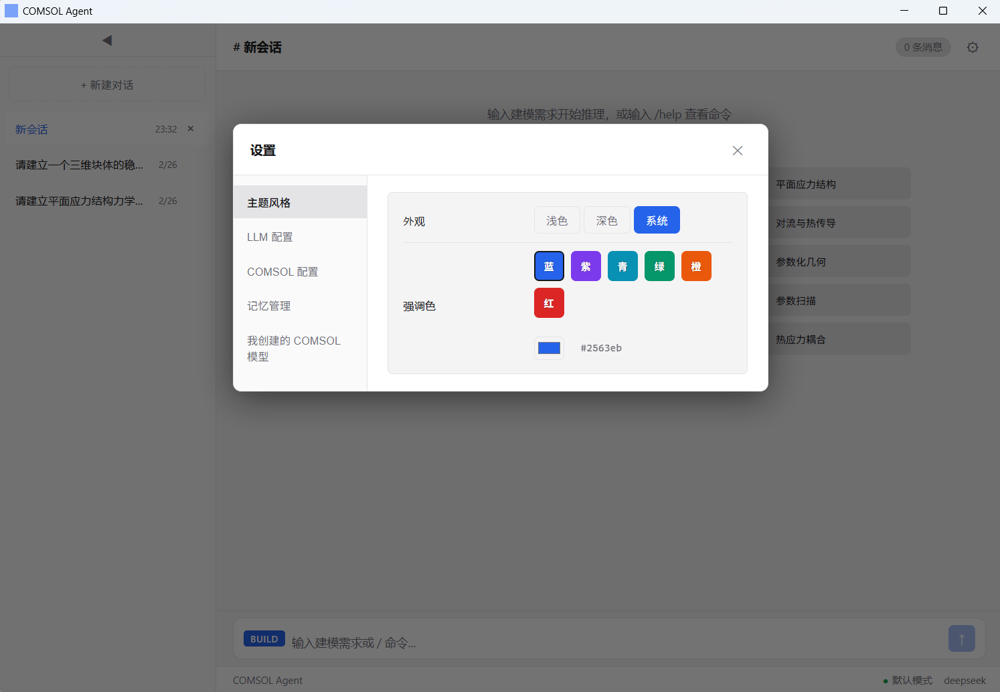
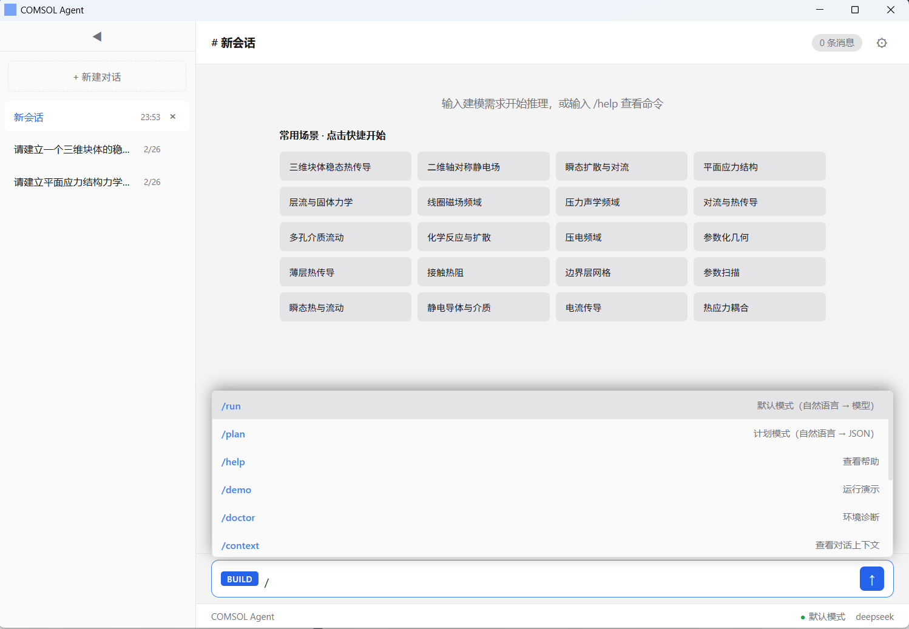
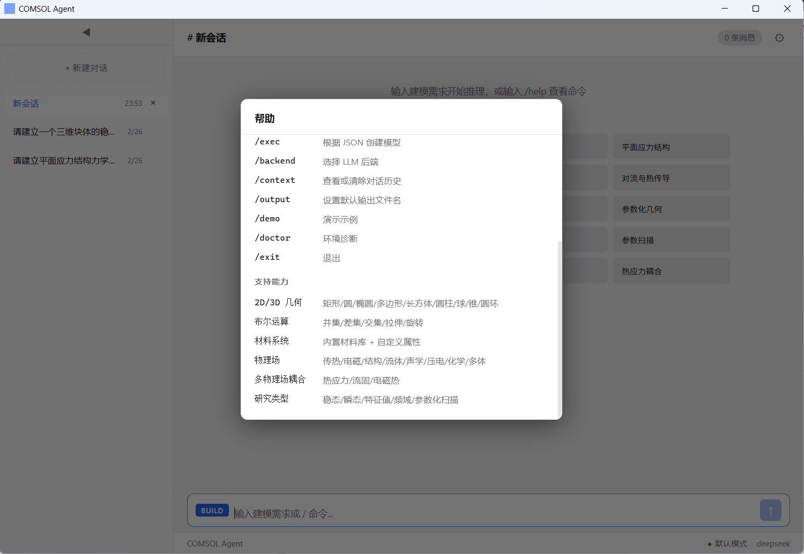

# COMSOL Multiphysics Agent

将自然语言描述的 COMSOL 建模需求自动转换为完整 .mph 模型文件的智能 Agent，支持几何、物理场、网格、研究与求解的完整仿真流程。

[](https://www.python.org/downloads/)
[](https://opensource.org/licenses/MIT)

---

## 简介

COMSOL Agent 基于 **ReAct（Reasoning & Acting）** 架构：通过自然语言理解需求、规划建模步骤、执行 COMSOL Java API 并观察结果、迭代改进，最终生成可直接在 COMSOL Multiphysics 中打开的 `.mph` 模型文件。提供 **Tauri + React 桌面应用** 与 **Python API** 两种使用方式，支持多种 LLM 后端（DeepSeek、Kimi、Ollama、OpenAI 兼容等）。

---

## 功能特性

- **ReAct 闭环**：推理（理解与规划）→ 执行（几何/物理场/网格/研究）→ 观察 → 迭代，自动生成 .mph
- **多 LLM 后端**：Dashscope (Qwen)、OpenAI、OpenAI 兼容、Ollama（本地/远程）
- **COMSOL 集成**：直接调用 Java API 或生成代码执行，支持 6.1+（6.3+ 推荐使用 plugins 目录）
- **桌面应用**：Tauri 2 + React，支持主题切换、推理任务、记忆管理、LLM 与 COMSOL 环境配置
- **上下文与记忆**：对话历史、摘要式记忆、自定义别名，提升多轮解析准确性

---

## 界面预览

| 主要界面 | 推理任务 |
|----------|----------|
|  |  |

| 推理任务（续） | LLM 配置 |
|----------------|-----------|
|  |  |

| COMSOL 环境配置 | 记忆管理 | 主题切换 |
|-----------------|----------|----------|
|  |  |  |

| 命令浮窗 | 操作帮助 |
|----------|----------|
|  |  |

---

## 安装

### 环境要求

- **Python 3.8+**
- **COMSOL Multiphysics**（已安装）
- **Java JDK 8+**（与 COMSOL 兼容；项目也可使用内置 JDK 11）

### 方式一：桌面版（推荐，仅 Windows）

从 [GitHub Releases](https://github.com/iammm0/comsol-agent/releases) 下载 Windows 安装包（exe 或 msi，tag 格式为 `desktop-v*`），安装后运行即可，无需单独安装 Python。暂不支持 macOS/Linux 桌面版。

### 方式二：从源码运行（含桌面应用）

```bash
git clone https://github.com/iammm0/comsol-agent.git
cd comsol-agent

# 使用 uv 安装依赖（需先安装 uv: https://docs.astral.sh/uv/）
uv sync

# 启动桌面应用（无参数即启动 Tauri 桌面端）
uv run comsol-agent
```

开发模式下需安装 [Node.js](https://nodejs.org/) 与 [Rust](https://rustup.rs/)；若已构建过桌面端，会优先运行本地可执行文件。

### 方式三：仅安装 Python 包（无桌面 UI）

```bash
uv sync
# 或构建分发包后安装
uv build
uv pip install dist/agent_for_comsol_multiphysics-*.whl
```

安装与构建细节见 [docs/getting-started/INSTALL.md](docs/getting-started/INSTALL.md)。

---

## 环境配置

安装后需配置 **LLM 后端** 与 **COMSOL 路径**（桌面应用内也可在设置页配置）。

### 必需

1. **LLM**：设置 `LLM_BACKEND`（如 `deepseek`、`kimi`、`ollama`、`openai-compatible`），并配置对应 API Key / URL。
2. **COMSOL**：设置 `COMSOL_JAR_PATH`  
   - **COMSOL 6.3+**（推荐）：填 `plugins` 目录，例如  
     `C:\Program Files\COMSOL\COMSOL63\Multiphysics\plugins` 或 `/opt/comsol63/multiphysics/plugins`  
   - **6.1 及更早**：填单个 jar 路径，如 `安装目录/lib/win64/comsol.jar`。

### 可选

- **JAVA_HOME**：不配置时优先用系统 Java，或使用项目内置 JDK 11（自动下载到 `runtime/java`）。
- **JAVA_DOWNLOAD_MIRROR**：国内可设 `tsinghua` 使用清华镜像。
- **MODEL_OUTPUT_DIR**：模型输出目录，默认项目根目录下的 `models`。

### 配置方式

**使用 .env 文件（推荐）**：在项目根目录创建 `.env`，例如：

```env
LLM_BACKEND=ollama
OLLAMA_URL=http://localhost:11434
OLLAMA_MODEL=llama3
COMSOL_JAR_PATH=C:\Program Files\COMSOL\COMSOL63\Multiphysics\plugins
```

更多后端示例（DeepSeek、Kimi、OpenAI 兼容等）见 [docs/getting-started/llm-backends.md](docs/getting-started/llm-backends.md)。  
在桌面应用内输入 **`/doctor`** 可做环境诊断，详见 [docs/getting-started/CONFIG.md](docs/getting-started/CONFIG.md)。

---

## 使用方法

### 桌面应用（推荐）

```bash
uv run comsol-agent
```

- **默认模式**：底部输入框输入自然语言建模需求（如「创建一个宽 1 米、高 0.5 米的矩形」），直接生成 COMSOL 模型。
- **计划模式**：输入 `/plan` 切换为仅解析为 JSON；`/run` 切回默认模式。
- **斜杠命令**：`/demo` 演示、`/doctor` 环境诊断、`/context` 摘要与历史、`/backend` 选择 LLM、`/output` 设置输出文件名、`/help` 帮助、`/quit` 退出。

### Python API

```python
from agent.react.react_agent import ReActAgent

react_agent = ReActAgent(max_iterations=10)
model_path = react_agent.run("创建一个宽1米、高0.5米的矩形")
print(f"模型已生成: {model_path}")
```

更多示例见 [docs/getting-started/EXAMPLE.md](docs/getting-started/EXAMPLE.md)。

---

## 项目结构

```
comsol-agent/
├── README.md, pyproject.toml, uv.lock, env.example
├── desktop/          # Tauri 2 + React 桌面应用
├── docs/             # 文档索引见 docs/README.md
├── prompts/          # 提示词模板（planner / executor / react）
├── schemas/           # 数据模型（geometry, physics, study, task）
├── agent/             # 主流程包（见 agent/README.md）
├── scripts/           # 构建与测试脚本
├── assets/            # README 与文档用截图
└── tests/             # 单元测试
```

---

## 架构概览

```
用户输入（自然语言）
    ↓
[Think] 推理引擎：理解需求、规划步骤、验证计划
    ↓
[Act] 行动执行器：执行建模操作（几何/物理场/网格/研究）
    ↓
[Observe] 观察器：检查执行结果、验证模型状态
    ↓
[Iterate] 迭代控制器：根据观察结果改进计划
    ↓
完整的 .mph 模型文件
```

详细架构见 [docs/architecture/architecture.md](docs/architecture/architecture.md)。

---

## 开发

- **测试**：`pytest tests/`
- **格式**：`black agent/ tests/ main.py`
- **贡献**：分支与提交规范见 [docs/project/CONTRIBUTING.md](docs/project/CONTRIBUTING.md)。

桌面端发布通过 GitHub Actions 仅构建 Windows 安装包（exe/msi），推送到 `release` 分支或打 tag `desktop-v*` 触发，产物见 [GitHub Releases](https://github.com/iammm0/comsol-agent/releases)。

---

## 常见问题

**Q: COMSOL JAR 找不到？**  
A: 6.3+ 请配置为 `plugins` 目录；6.1 及更早配置为单个 jar 路径。

**Q: Java 环境报错？**  
A: 可依赖项目内置 JDK 11；若用系统 Java，请确保 `JAVA_HOME` 与 COMSOL 兼容。

**Q: API 调用失败？**  
A: 检查当前 LLM 后端对应的 API Key（如 `DEEPSEEK_API_KEY`、`KIMI_API_KEY`）是否已在 `.env` 或环境变量中配置。

**Q: Windows 上桌面应用构建报错 linker / link.exe not found？**  
A: 需安装 [Build Tools for Visual Studio](https://visualstudio.microsoft.com/zh-hans/visual-cpp-build-tools/) 并勾选「使用 C++ 的桌面开发」；或使用 GNU 工具链：`rustup default stable-x86_64-pc-windows-gnu`（需 MSYS2/MinGW）。详见 [docs/getting-started/INSTALL.md](docs/getting-started/INSTALL.md) 故障排除。

---

## 许可证

[MIT](https://opensource.org/licenses/MIT)
