<div align="center">
  <h1>Multiphysics Modeling Agent</h1>
  <p>AI 驱动的 COMSOL 自动化建模智能体（自然语言 → .mph）</p>
  <p>
    <a href="https://www.python.org/downloads/"></a>
    
    <a href="LICENSE"></a>
    
    
    
  </p>
  <p><b>中文</b> | English (coming soon)</p>
</div>

将自然语言描述的 COMSOL 建模需求自动转换为完整 .mph 模型文件的智能 Agent，支持几何、物理场、网格、研究与求解的完整仿真流程。本项目**仅基于 COMSOL 官方开放的 Java API 进行二次开发**，仅供学习与交流使用。

> 当前项目以 **COMSOL Multiphysics 6.3** 为目标版本研发、测试与维护；案例库、文档知识库、路径示例与相关提示均以 **6.3** 为准。

---

## 目录

- [重要声明 / Disclaimer](#重要声明--disclaimer)
- [简介](#简介)
- [功能特性](#功能特性)
- [界面预览](#界面预览)
- [安装](#安装)
- [环境配置](#环境配置)
- [使用方法](#使用方法)
- [文档](#文档)
- [项目结构](#项目结构)
- [架构详图](#架构详图)
- [开发](#开发)
- [常见问题](#常见问题)
- [许可证](#许可证)

## 重要声明 / Disclaimer

使用本软件即表示您已知晓并同意以下条款及 [LICENSE](LICENSE) 中的补充声明：

1. **本项目为独立开源工具，与 COMSOL 官方无任何关联、非官方产品、非官方插件。**
2. **本项目仅通过 COMSOL 官方公开 API 进行自动化调用与脚本生成，不包含任何 COMSOL 核心代码、不破解、不修改、不绕过 COMSOL 许可机制。**
3. **使用本工具的前提是用户已拥有合法、正版的 COMSOL Multiphysics 软件许可。**
4. **任何使用盗版、破解、未授权版本 COMSOL 的行为，均违反 COMSOL 最终用户许可协议及相关法律法规，由此产生的一切法律责任、风险与后果由使用者自行承担，与本项目作者及贡献者无关。**
5. **本项目仅用于学习、科研与合法合规的工程自动化用途，请勿用于商业侵权或非法用途。**

---

## 简介

Multiphysics Modeling Agent（mph-agent）基于 **ReAct（Reasoning & Acting）** 架构：通过自然语言理解需求、规划建模步骤、执行 COMSOL Java API 并观察结果、迭代改进，最终生成可直接在 COMSOL Multiphysics 中打开的 `.mph` 模型文件。提供 **Tauri + React 桌面应用** 与 **源码运行**，不提供 Python 包分发；支持多种 LLM 后端（DeepSeek、Kimi、Ollama、OpenAI 兼容等）。

---

## 功能特性

- **ReAct 闭环**：推理（理解与规划）→ 执行（几何/物理场/网格/研究）→ 观察 → 迭代，自动生成 .mph
- **讨论模式**：`/discuss` 进入增量式结构化讨论，逐步确认建模意图后再规划（`DiscussionModeHandler`）
- **阶段性规划（计划模式）**：`/plan` 触发 `PlanModeHandler`，支持澄清问题循环（`PlanNeedsClarification`），与用户确认后再执行
- **多 LLM 后端**：DeepSeek、Kimi、OpenAI 兼容、Ollama（本地/远程）
- **COMSOL 集成**：面向 COMSOL Multiphysics 6.3 的 Java API 与 `plugins` 目录结构，直接调用 Java API 或生成代码执行
- **JavaAPI 操作目录**：`/ops_catalog` 列出所有可用的 COMSOL Java API 封装操作（`JavaAPIController.get_ops_catalog()`）
- **案例库**：`/case_library` 从 COMSOL 官网同步案例索引；`/case` 从本地 .mph 文件提取结构化操作 JSON
- **技能库**：内置 Markdown 格式技能（`skills/`），支持向量检索与注入；`/skills` 管理本地技能（创建/导入/列出）
- **文档知识库**：可从本机已安装的 COMSOL 官方 HTML/TXT 文档构建本地 SQLite/FTS 知识库，推理时自动检索相关片段
- **桌面应用**：Tauri 2 + React，支持主题切换、推理任务、记忆管理、LLM 与 COMSOL 环境配置
- **上下文与记忆**：对话历史、摘要式记忆、自定义别名，提升多轮解析准确性；记忆更新通过 `asyncio` 异步执行，无需额外服务

---

## 界面预览

| 主界面 | 推理及建模过程 |
|----------|----------|
| 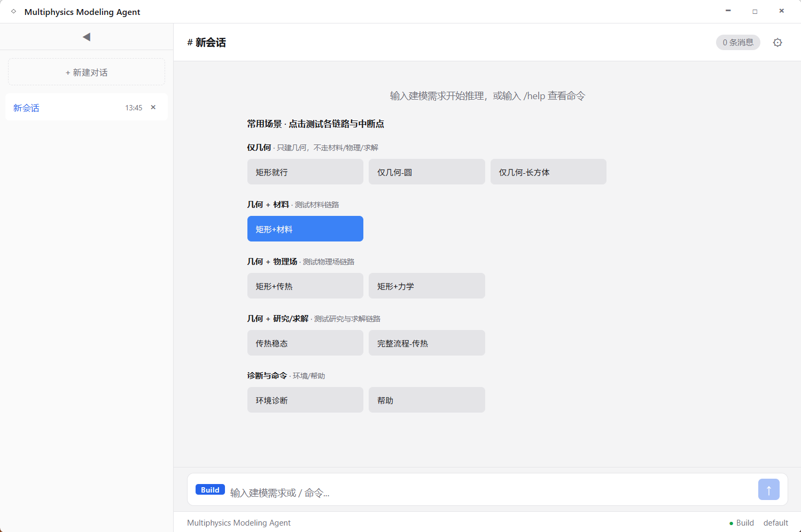 | 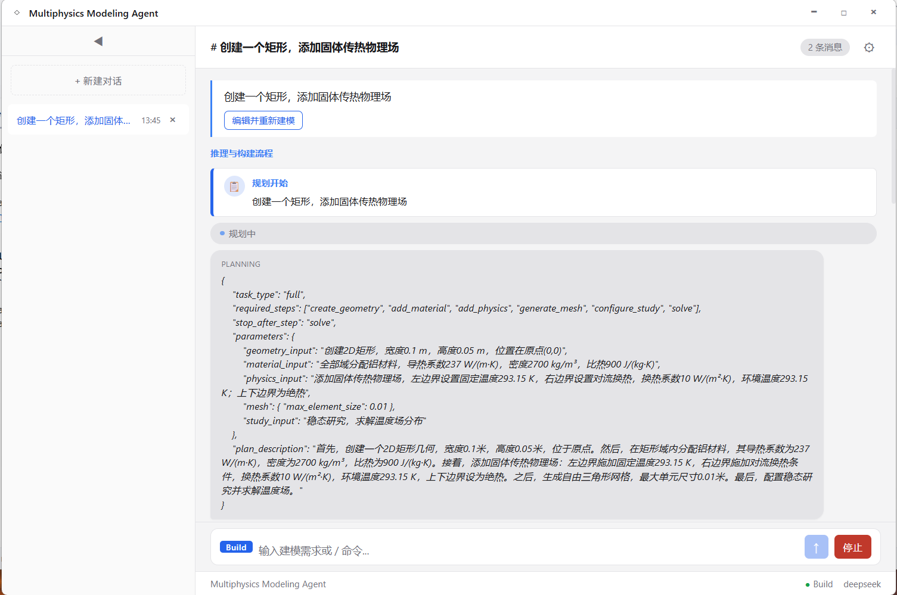 |

| 推理及建模过程（续） | 大模型配置 |
|----------------|-----------|
| 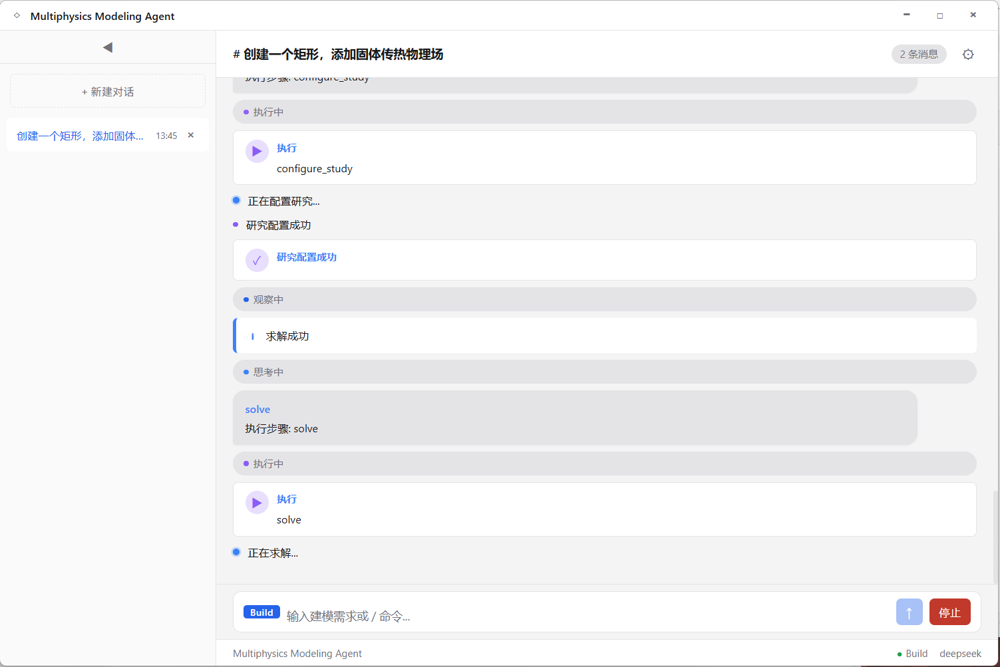 | 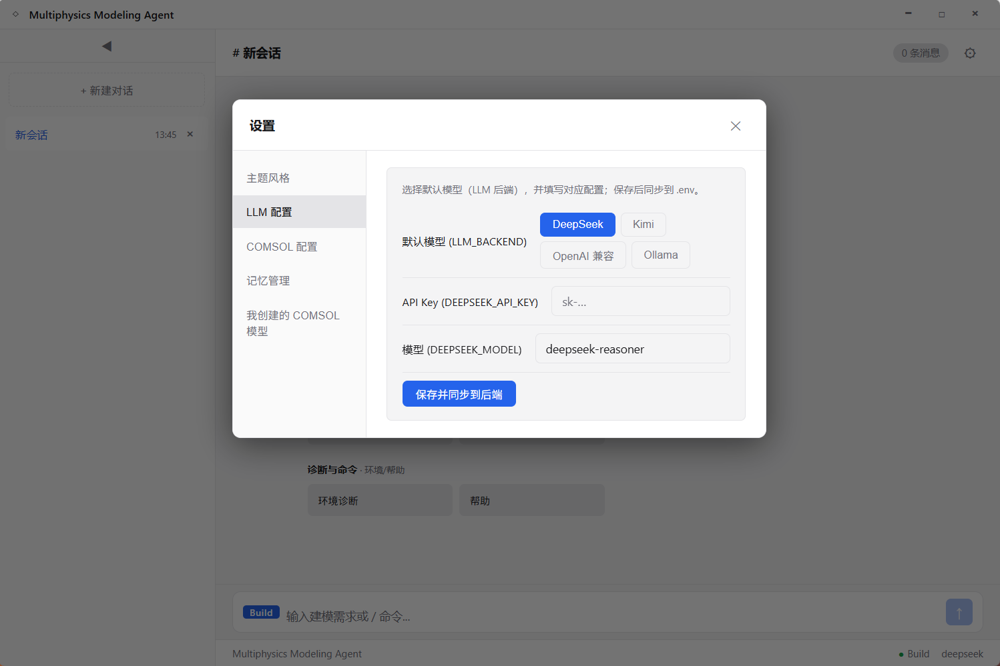 |

| COMSOL/JAVA 环境配置 | 记忆管理 | 主题风格 |
|-----------------|----------|----------|
| 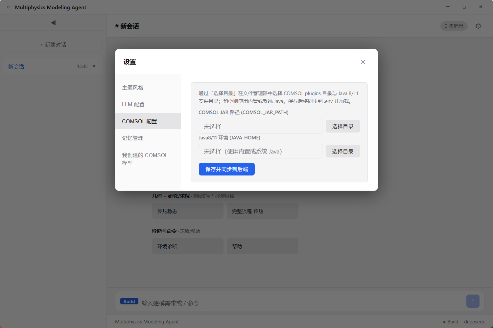 | 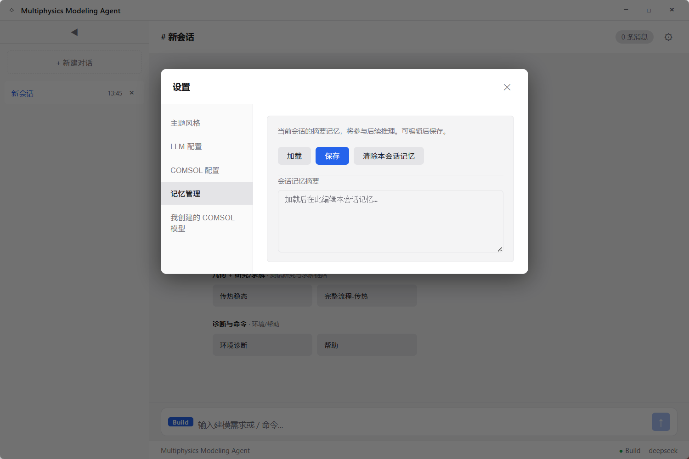 | 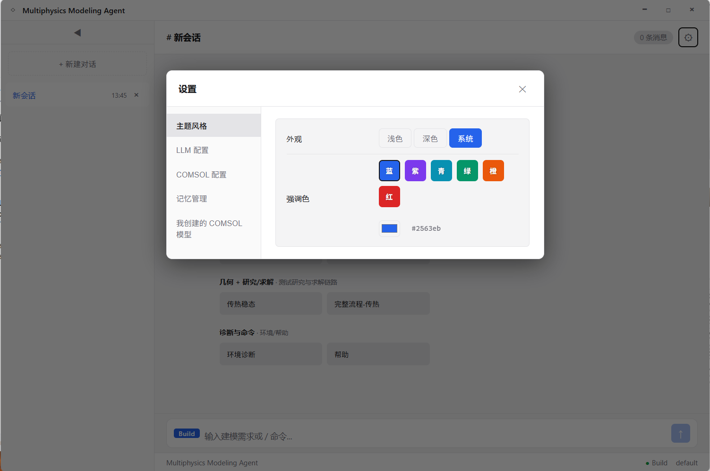 |

| 待选斜杠命令 | 帮助命令详情 |
|----------|----------|
| 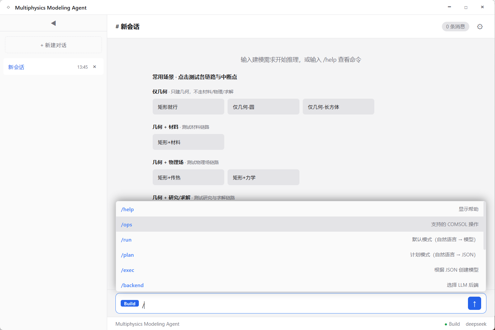 | 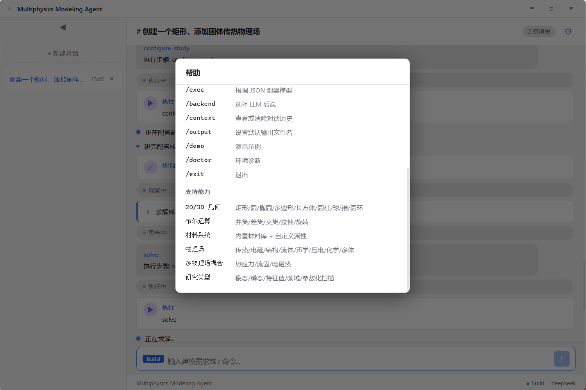 |

| 建模结果 |
|----------|
| 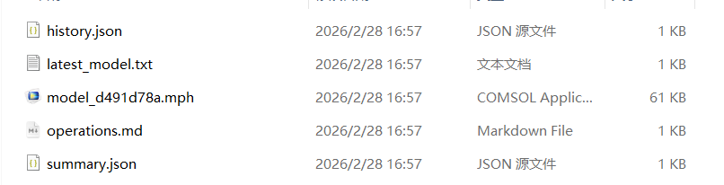 |

---

## 安装

本项目**仅提供桌面版安装包与源码运行**，不提供 Python 包（pip install）分发。

### 环境要求

- **Python 3.8+**（推荐 3.11/3.12）
- **COMSOL Multiphysics 6.3**（已安装）
- **Java JDK 8+**（与 COMSOL 兼容；项目也可使用内置 JDK 11）

### 方式一：桌面版（推荐，仅 Windows）

从 [GitHub Releases](https://github.com/iammm0/mph-agent/releases) 下载 Windows 安装包（exe 或 msi，tag 格式为 `desktop-v*`），安装后运行即可。安装包内已包含 **Java 11**，无需单独安装 Python 或 JDK。暂不支持 macOS/Linux 桌面版。

### 方式二：从源码运行（桌面端与源码运行，不提供 Python 包）

```bash
git clone https://github.com/iammm0/mph-agent.git
cd mph-agent

# 使用 uv 安装依赖（需先安装 uv: https://docs.astral.sh/uv/）
uv sync

# 启动桌面应用（无参数即启动 Tauri 桌面端）
uv run python cli.py
```

开发模式下需安装 [Node.js](https://nodejs.org/) 与 [Rust](https://rustup.rs/)；若已构建过桌面端，会优先运行本地可执行文件。

若您从旧名称 comsol-agent 迁移，请将命令与配置中的 `comsol-agent` 改为 `mph-agent`，桌面端需重新安装以更新产品名与 identifier。

安装与构建细节见 [docs/getting-started/INSTALL.md](docs/getting-started/INSTALL.md)。

---

## 环境配置

安装后需配置 **LLM 后端** 与 **COMSOL 路径**（桌面应用内也可在设置页配置）。

### 必需

1. **LLM**：设置 `LLM_BACKEND`（如 `deepseek`、`kimi`、`ollama`、`openai-compatible`），并配置对应 API Key / URL。
2. **COMSOL**：设置 `COMSOL_JAR_PATH`  
   - **COMSOL Multiphysics 6.3**：填 `plugins` 目录，例如  
     `C:\Program Files\COMSOL\COMSOL63\Multiphysics\plugins` 或 `/opt/comsol63/multiphysics/plugins`

### 可选

- **JAVA_HOME**：不配置时优先用系统 Java，或使用项目内置 JDK 11（自动下载到 `runtime/java`）。
- **JAVA_DOWNLOAD_MIRROR**：国内可设 `tsinghua` 使用清华镜像。
- **JAVA_SKIP_AUTO_DOWNLOAD**：设为 `1` 时禁止自动下载内置 JDK，仅使用已存在的 `JAVA_HOME` 或 `runtime/java`。
- **COMSOL_NATIVE_PATH**：手动指定含 JNI `.dll`/`.so` 的本地库目录（解决 `UnsatisfiedLinkError`）；留空时按 `COMSOL_JAR_PATH` 自动推导。
- **MODEL_OUTPUT_DIR**：模型输出目录，默认项目根目录下的 `models`。

### 配置方式

**使用 .env 文件（推荐）**：在项目根目录创建 `.env`，例如：

```env
LLM_BACKEND=ollama
OLLAMA_URL=http://localhost:11434
OLLAMA_MODEL=llama3
COMSOL_JAR_PATH=C:\Program Files\COMSOL\COMSOL63\Multiphysics\plugins
```

更多后端示例（DeepSeek、Kimi、OpenAI 兼容等）见 [docs/getting-started/llm-backends.md](docs/getting-started/llm-backends.md)。  
在桌面应用内输入 **`/doctor`** 可做环境诊断，详见 [docs/getting-started/CONFIG.md](docs/getting-started/CONFIG.md)。

### 可选：导入本机 COMSOL 文档知识库

项目不会把 COMSOL 在线文档整站直接打包进仓库或发行包；如果你本机已安装官方文档，可将其导入为本地知识库，供 Agent 在推理时自动检索：

```bash
# source 可传 COMSOL Multiphysics 根目录、plugins 目录，或 doc 目录
uv run python scripts/import_comsol_docs.py "C:\Program Files\COMSOL\COMSOL63\Multiphysics"
```

也可在 `.env` 中设置：

```dotenv
COMSOL_DOC_PATH=C:\Program Files\COMSOL\COMSOL63\Multiphysics
```

默认索引文件输出到 `data/doc_knowledge/comsol_docs.db`。导入完成后，现有 planner / ReAct 流程会自动把检索到的文档片段注入 prompt，无需额外开关。

---

## 使用方法

### 桌面应用（推荐）

```bash
uv run python cli.py
```

- **默认模式**：底部输入框输入自然语言建模需求（如「创建一个宽 1 米、高 0.5 米的矩形」），直接生成 COMSOL 模型。
- **计划模式**：输入 `/plan` 切换为仅解析为 JSON；`/run` 切回默认模式。
- **斜杠命令**：`/demo` 演示、`/doctor` 环境诊断、`/context` 摘要与历史、`/backend` 选择 LLM、`/output` 设置输出文件名、`/help` 帮助、`/quit` 退出。

### Python API（源码运行下使用）

在项目根目录执行 `uv sync` 后，可从源码导入使用：

```python
from agent.react.react_agent import ReActAgent

react_agent = ReActAgent(max_iterations=10)
model_path = react_agent.run("创建一个宽1米、高0.5米的矩形")
print(f"模型已生成: {model_path}")
```

更多示例见 [docs/getting-started/EXAMPLE.md](docs/getting-started/EXAMPLE.md)。

---

## 文档

- 文档索引：[docs/README.md](docs/README.md)
- 安装与配置：[INSTALL.md](docs/getting-started/INSTALL.md)、[CONFIG.md](docs/getting-started/CONFIG.md)
- 架构设计：[architecture.md](docs/architecture/architecture.md)
- 技能系统：[skills/README.md](skills/README.md)

---

## 项目结构

```
mph-agent/
├── README.md, pyproject.toml, uv.lock, env.example
├── desktop/          # Tauri 2 + React 桌面应用
├── docs/             # 文档索引见 docs/README.md
├── prompts/          # 提示词模板（planner / executor / react）
├── schemas/          # 数据模型（geometry, physics, study, task）
├── agent/            # 主流程包（见 agent/README.md）
├── skills/           # 领域技能库（SKILL.md）
├── data/             # 技能索引数据库（默认 data/skills.db）
├── scripts/          # 构建与测试脚本
├── assets/            # README 与文档用截图
└── tests/             # 单元测试
```

---

## 架构详图

以下架构图使用 `assets/` 下的图片，便于维护与渲染一致性。

### 系统总体架构（三层）


### 数据流与路由

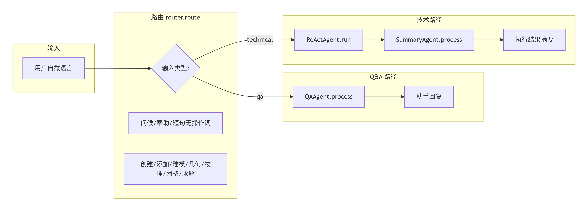

### ReAct 循环（Think → Act → Observe → Iterate）


### Action 类型与执行层关系


### 数据模型（Schemas）


### 事件流（EventBus → 桌面端流式更新）

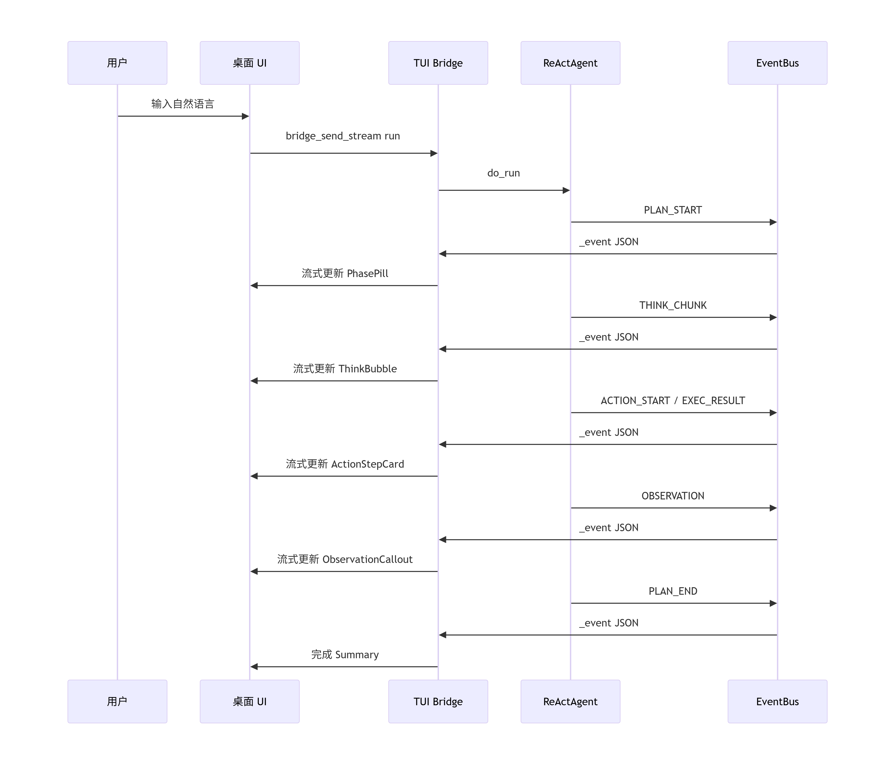

---

详细架构与扩展说明见 [docs/architecture/architecture.md](docs/architecture/architecture.md)。

---

## 开发

- **测试**：`uv run pytest`
- **Lint**：`uv run ruff check .`
- **格式化**：`uv run black .`
- **贡献**：分支与提交规范见 [docs/project/CONTRIBUTING.md](docs/project/CONTRIBUTING.md)。

桌面端发布通过 GitHub Actions 仅构建 Windows 安装包（exe/msi），推送到 `release` 分支或打 tag `desktop-v*` 触发，产物见 [GitHub Releases](https://github.com/iammm0/mph-agent/releases)。

---

## 常见问题

**Q: COMSOL JAR 找不到？**  
A: 本项目默认面向 COMSOL Multiphysics 6.3，请将 `COMSOL_JAR_PATH` 配置为 6.3 安装目录下的 `plugins` 目录。

**Q: Java 环境报错？**  
A: 可依赖项目内置 JDK 11；若用系统 Java，请确保 `JAVA_HOME` 与 COMSOL 兼容。

**Q: API 调用失败？**  
A: 检查当前 LLM 后端对应的 API Key（如 `DEEPSEEK_API_KEY`、`KIMI_API_KEY`）是否已在 `.env` 或环境变量中配置。

**Q: Windows 上桌面应用构建报错 linker / link.exe not found？**  
A: 需安装 [Build Tools for Visual Studio](https://visualstudio.microsoft.com/zh-hans/visual-cpp-build-tools/) 并勾选「使用 C++ 的桌面开发」；或使用 GNU 工具链：`rustup default stable-x86_64-pc-windows-gnu`（需 MSYS2/MinGW）。详见 [docs/getting-started/INSTALL.md](docs/getting-started/INSTALL.md) 故障排除。

---

## 许可证

[MIT](https://opensource.org/licenses/MIT)。使用本软件即表示您已知晓并同意 README 与 LICENSE 中的 COMSOL 相关声明。
