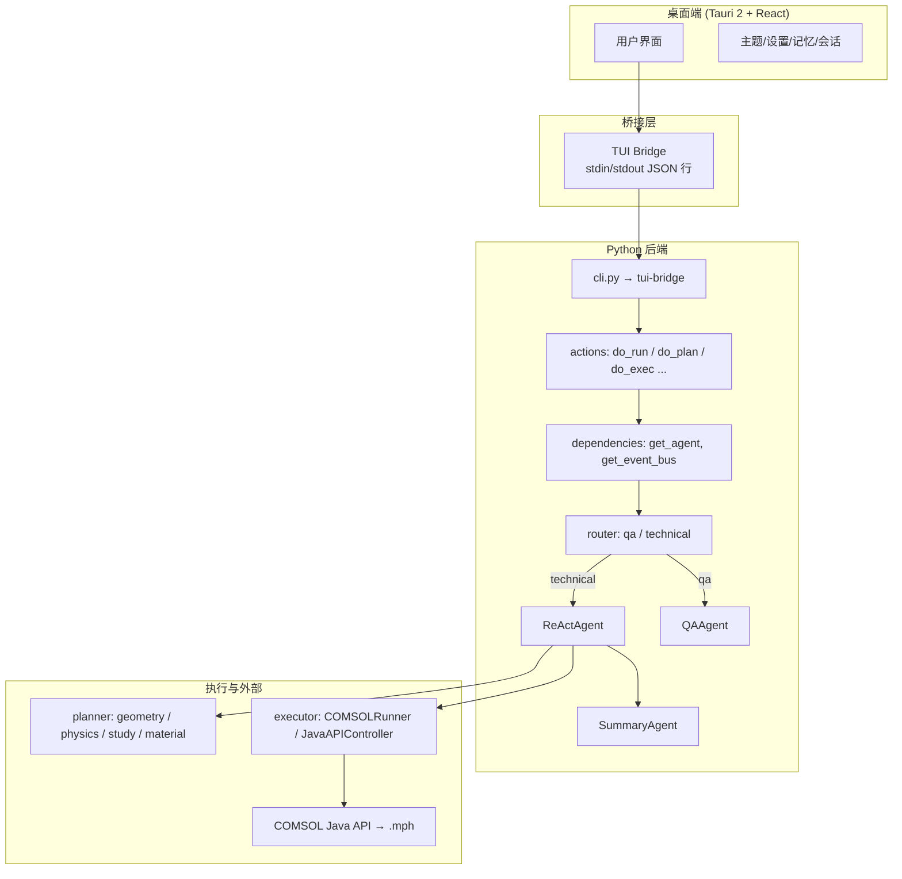
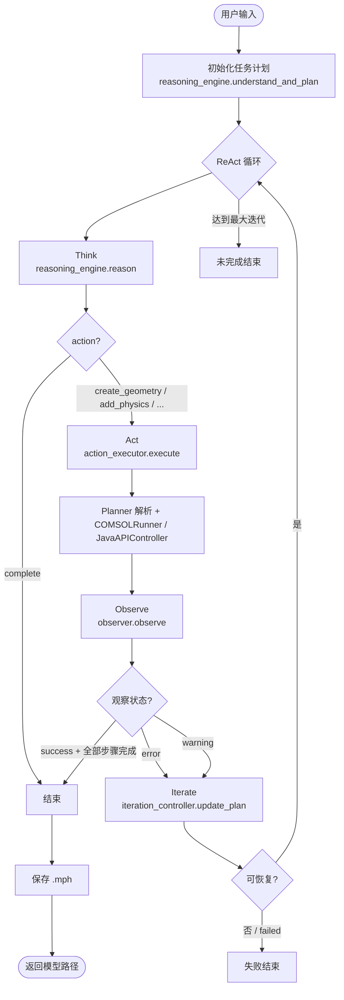
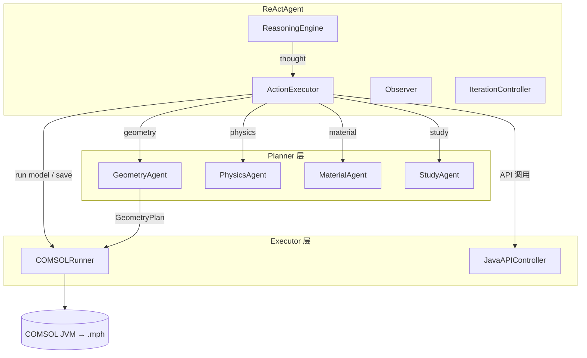
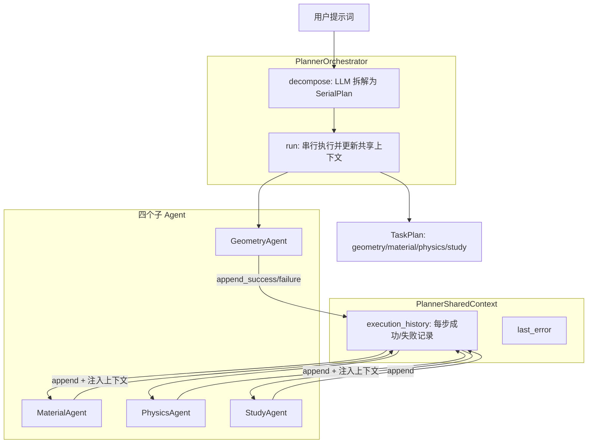

# 架构设计文档

本文档描述 COMSOL Agent **当前已实现**的系统架构、ReAct 模式与端到端工作流程，并配有架构图与流程图。

---

## 一、系统总体架构

系统分为三层：**桌面端（Tauri + React）**、**桥接层（TUI Bridge）**、**Python 后端（Agent 与 COMSOL 执行）**。用户通过桌面应用或 CLI 输入自然语言，经路由与 ReAct 流程，最终生成 `.mph` 模型文件。



**数据流概要**：

- **桌面端**：用户输入 → 通过 Tauri 调用 `bridge_send` / `bridge_send_stream`，以 JSON 行与 Python 进程通信。
- **桥接层**：`cli.py tui-bridge` 启动后从 stdin 读 JSON 请求（如 `cmd: "run"`），调用 `agent.actions.do_run` 等，将结果与事件以 JSON 行写回 stdout；桌面端解析 `_event` 行做流式更新。
- **后端**：`do_run` 使用 `get_agent("core")` 拿到 `ReActAgent`，执行 ReAct 循环；`get_agent("qa")` / `get_agent("summary")` 用于问答与结果摘要。执行层通过 planner 与 executor 调用 COMSOL Java API，生成 `.mph` 文件。

---

## 二、当前实现的架构模式

入口统一为 **路由（router）**：根据用户输入决定走 **Q&A** 还是 **技术/执行流**。技术流采用 **ReAct Core + Summary**，不再使用单一的「Planner → Executor」直线管道；ReAct 内部会多次调用 Planner 与 Executor，并带观察与迭代。

```mermaid
flowchart LR
    subgraph 入口["入口"]
        Input[用户输入]
    end

    subgraph 路由["路由 (router)"]
        Route[route(input) → qa | technical]
    end

    subgraph 分支["分支"]
        QABranch[Q&A 分支]
        TechBranch[技术分支]
    end

    subgraph QAPath["Q&A 路径"]
        QAAgent[QAAgent.process]
        QAReply[助手回复]
    end

    subgraph TechPath["技术路径"]
        ReAct[ReActAgent.run]
        SummaryAgent[SummaryAgent.process]
        FinalSummary[执行结果摘要]
    end

    Input --> Route
    Route -->|qa| QABranch
    Route -->|technical| TechBranch
    QABranch --> QAAgent --> QAReply
    TechBranch --> ReAct --> SummaryAgent --> FinalSummary
```

**路由规则（概要）**：

- 匹配问候/再见/帮助类关键词且输入较短 → `qa`。
- 匹配操作类动词（创建、添加、建模、几何、物理、网格、求解等）→ `technical`。
- 短句且无操作词 → 默认 `qa`。

**依赖注入**：`get_agent(agent_type)` 懒加载并缓存 `qa` / `planner` / `material` / `core` / `summary`；`core` 在传入 `event_bus` 时不缓存，保证每次 run 使用独立 EventBus，便于桌面端流式展示。

---

## 三、ReAct 工作流程

技术路径的核心是 **ReActAgent.run**：**Think → Act → Observe → Iterate** 循环，直到任务完成或达到最大迭代次数/不可恢复错误。



**各阶段职责**：

| 阶段 | 组件 | 职责 |
|------|------|------|
| **初始化计划** | ReasoningEngine | 理解需求（understand_requirement）、规划执行路径（plan_execution_path）、推理检查点（plan_reasoning_path），产出 ReActTaskPlan |
| **Think** | ReasoningEngine | 根据当前计划与历史观察，推理下一步 action（如 create_geometry、add_physics、complete）及参数 |
| **Act** | ActionExecutor | 根据 action 调用对应 Planner（GeometryAgent / PhysicsAgent / MaterialAgent / StudyAgent）与 COMSOLRunner / JavaAPIController，执行几何/材料/物理/网格/研究/求解等 |
| **Observe** | Observer | 根据执行结果与步骤状态，生成 Observation（success / warning / error），供迭代判断 |
| **Iterate** | IterationController | 根据 Observation 更新计划（修正步骤、回退或重试），若判定不可恢复则置 plan.status = "failed" |

**事件与可观测性**：ReActAgent 接受可选 `event_bus`。运行过程中会发出 `PLAN_START`、`PLAN_END`、`THINK_CHUNK`、`ACTION_START`、`EXEC_RESULT`、`OBSERVATION`、`TASK_PHASE`、`STEP_START`、`STEP_END` 等事件；TUI Bridge 将事件以 JSON 行推到桌面端，用于流式 UI 更新。

---

## 四、ReAct 内部与执行层关系

ReAct 主循环只做「思考 → 执行 → 观察 → 迭代」的编排；具体「执行」由 **ActionExecutor** 委托给 **Planner** 与 **Executor**。



- **Planner**：将自然语言或 thought 中的参数解析为结构化计划（GeometryPlan / PhysicsPlan / StudyPlan 等）。
- **Executor**：COMSOLRunner 负责 JVM 生命周期、从计划创建模型、保存 .mph；JavaAPIController 封装细粒度 Java API 调用。
- **Skills**：ReasoningEngine / Planner 通过 `get_skill_injector()` 与 `prompt_loader` 注入隐性知识与提示词模板。

---

## 五、Planner 编排器与 A2A 通信

Planner 层设有一个**总编排 Agent（PlannerOrchestrator）**：将用户提示词拆解为**串行任务**（geometry → material → physics → study），并依次调用四个子 Agent（几何建模、材料填充、物理场添加、求解研究）。各子 Agent 通过**共享上下文（PlannerSharedContext）**通信，以便在遇到 error/exception 时，后续 Agent 能获知前面步骤的修改与错误，便于重试或适配（参考 a2a-codes 的 A2A 模式）。



**要点**：

- **decompose(user_input)**：用 LLM 将用户需求拆成有序步骤（`SerialPlan`），每步含 `agent_type`（geometry/material/physics/study）、`description`、`input_snippet`。
- **run(user_input, context, shared_context)**：按 `SerialPlan` 顺序调用对应 Agent；每步执行前将「其他 Agent 已完成的修改与错误」注入该步的 `context`，执行后向 `PlannerSharedContext` 追加成功或失败记录。
- **ReasoningEngine** 默认使用编排器（`use_planner_orchestrator=True`）生成初始 ReAct 计划；编排器产出的 `TaskPlan` 转为 `execution_path` 并填入 `geometry_plan`、`material_plan`、`physics_plan`、`study_plan`，供 ActionExecutor 直接使用，遇错时后续步骤仍能通过共享上下文获知前面状态。

---

## 六、核心组件与目录对应

| 区域 | 职责 | 主要文件/目录 |
|------|------|----------------|
| **路由与编排** | 路由、会话编排、依赖注入 | `agent/router.py`、`agent/session.py`、`agent/dependencies.py` |
| **动作入口** | do_run / do_plan / do_exec / 上下文与配置 | `agent/actions.py`、`agent/tui_bridge.py` |
| **ReAct 核心** | 推理、执行、观察、迭代 | `agent/react/react_agent.py`、`reasoning_engine.py`、`action_executor.py`、`observer.py`、`iteration_controller.py` |
| **Planner** | 自然语言 → 结构化计划；编排器串行调用四类 Agent、A2A 共享上下文 | `agent/planner/orchestrator.py`、`agent/planner/context.py`、`agent/planner/geometry_agent.py`、`physics_agent.py`、`study_agent.py`、`material_agent.py` |
| **Executor** | 计划 → COMSOL 调用 / .mph | `agent/executor/comsol_runner.py`、`java_api_controller.py`、`java_generator.py` |
| **Q&A / Summary** | 问答与结果摘要 | `agent/qa_agent.py`、`agent/summary_agent.py` |
| **事件与上下文** | EventBus、会话上下文、记忆 | `agent/events.py`、`agent/utils/context_manager.py`、`agent/memory_agent.py` |
| **技能与提示** | 技能加载、提示模板、LLM | `agent/skills/`、`agent/utils/prompt_loader.py`、`agent/utils/llm.py` |
| **数据模型** | 任务计划、几何/物理/研究 Schema | `schemas/task.py`、`schemas/geometry.py`、`schemas/physics.py`、`schemas/study.py` |

---

## 七、技术栈

- **Python 3.8+**
- **LLM**：多后端（Dashscope/DeepSeek、Kimi、OpenAI 兼容、Ollama 等），见 `agent/utils/llm.py` 与 `docs/getting-started/llm-backends.md`
- **桌面端**：Tauri 2 + React；与后端通过 TUI Bridge（stdin/stdout JSON 行）通信
- **Java 互操作**：jpype1，COMSOL Java API（6.1+，6.3+ 推荐 plugins 目录）
- **数据与配置**：Pydantic、`agent/utils/config.py`、`.env` / 环境变量

---

## 八、扩展与参考

- **多智能体范式**（Q&A / Planner / Core / Summary、路由、依赖注入）：`docs/agent-design-skills/agent-architecture.md`
- **会话与 EventBus**：`docs/agent-design-skills/session-and-events.md`
- **技能/插件系统**：`docs/agent-design-skills/skill-plugin-system.md`
- **COMSOL 三模块与共享上下文（扩展设想）**：`docs/architecture/comsol-modules-and-context.md`
