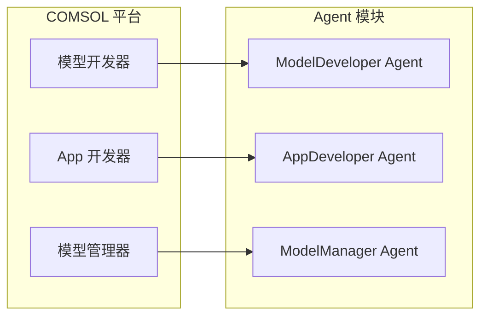
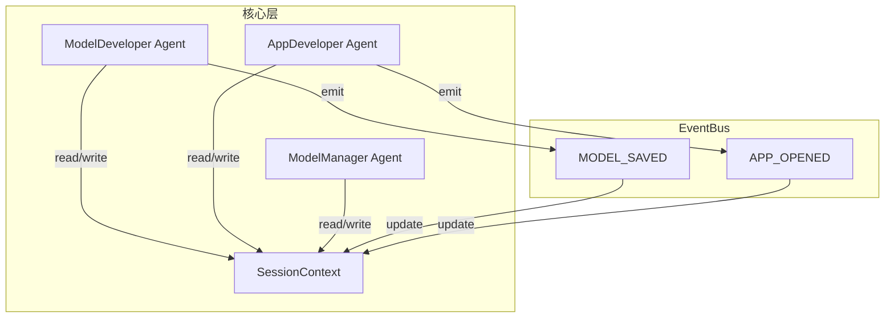

# COMSOL 三模块 Agent 与共享上下文

本文档描述 COMSOL Multiphysics® 三个内置组件与 Agent 模块的对应关系、目录与路由设想、共享上下文字段及 EventBus 使用方式，与 [agent-architecture.md](../agent-design-skills/agent-architecture.md)、[session-and-events.md](../agent-design-skills/session-and-events.md) 一致。

## 1. COMSOL 三组件与 Agent 模块对应

COMSOL 平台内置三个组件，与 Agent 模块一一对应：

| COMSOL 组件 | 职责 | Agent 模块 | 优先级 |
|-------------|------|------------|--------|
| **模型开发器（Model Builder）** | 创建/编辑/求解仿真模型：几何、物理场、网格、研究、结果分析 | **ModelDeveloper Agent** | 主攻 |
| **App 开发器（Application Builder）** | 基于模型定制仿真 App：Method 编辑、Form 设计、打包与部署 | **AppDeveloper Agent** | 次要 |
| **模型管理器（Model Manager）** | 仿真数据管理：模型、辅助数据、仿真 App 的版本与检索等 | **ModelManager Agent** | 次要 |

当前仓库的**主流程**在 **`agent/`** 下实现：Planner（几何/物理/研究）、Executor（COMSOL Java API 调用与代码生成）、ReAct 与 skills 等，服务于「自然语言 → .mph 模型」的建模流程，归属为**模型开发器 Agent**；后续可在此模块内扩展物理场、网格、研究、求解与结果分析。

## 2. 模块分离：目录与路由（设想）

### 2.1 目录/包划分（扩展设想）

若按三模块拆分，可在 `agent/` 下或独立包中按职责划分：

- **模型开发器**：当前已实现于 `agent/planner`、`agent/executor`、`agent/react` 等。  
  - 负责几何、物理、网格、研究、求解、结果。
- **App 开发器**：预留扩展。  
  - 负责 Method 编辑、Form 设计、App 打包/部署等（后续实现）。
- **模型管理器**：预留扩展。  
  - 负责模型/App 的列表、打开、保存、版本、检索等（后续实现）。

各模块内部采用「Planner → Executor → Summary」等分工；模块之间**不直接调用**，仅通过**共享上下文**与**事件/编排**协作。

### 2.2 路由层与模块分发

在现有「Q&A vs 技术/执行」路由之上，增加**模块路由**，按用户意图将请求分派到对应模块（或组合）：

- 示例：「建一个矩形」「加一个物理场」→ **ModelDeveloper**
- 示例：「把这个模型做成 App」「加一个输入框」→ **AppDeveloper**
- 示例：「列出最近模型」「打开某项目」→ **ModelManager**

路由结果建议使用明确类型（如 `Literal["model_developer", "app_developer", "model_manager", "qa"]`），由会话编排器根据该结果选择调用的 Agent 模块，并传入共享上下文。

## 3. 上下文同步：共享上下文与 EventBus

目标：**模块分离，但共享同一份会话/工作上下文**，避免重复建模或丢失「当前模型 / 当前 App」等状态。

### 3.1 共享上下文内容（SessionContext）

建议由会话编排器或专门的 ContextStore 维护一份 **SessionContext**（或 SharedContext），供三模块读写。建议包含：

| 字段/区域 | 说明 |
|-----------|------|
| **当前模型** | 当前会话绑定的模型路径、名称、是否已修改等 |
| **当前仿真 App** | 若处于 App 开发流程：关联的 .mph、Method、Form 等 |
| **模型管理器工作区** | 当前库/项目、最近打开列表等（可选） |
| **跨轮对话摘要/记忆** | 已有「上下文管理」落在此处，三模块共用 |

同一会话内，三个模块看到的是一份逻辑上的「当前工作状态」；上下文随会话创建/恢复而加载，随会话结束可归档。

### 3.2 实现方式（与 session-and-events 对齐）

- **会话编排器**持有或访问 **SessionContext**：各模块 Agent 在 `process` 前后只读写该上下文（如「当前模型路径」「上一步执行结果」），不各自维护互不知情的状态。
- **EventBus**：关键状态变更通过事件发布，订阅方更新上下文或 UI。例如：
  - 模型已保存 → 发布 `MODEL_SAVED`（payload：路径、名称等）
  - App 已打开 / 已关闭 → 发布 `APP_OPENED` / `APP_CLOSED`
  - 当前工作区切换 → 发布 `WORKSPACE_CHANGED`
- **生命周期**：上下文随会话创建/恢复而加载；事件仅用于通知与同步，不替代上下文作为事实来源。

### 3.3 事件与上下文关系示意

## 4. 优先级与落地顺序

1. **先巩固模型开发器 Agent**：在现有基础上明确归属到「模型开发器」模块，补齐几何→物理→网格→研究→求解链路，并引用 [comsol-api-links.md](../reference/comsol-api-links.md) 中的 API 文档。
2. **在文档与代码中落地「三模块 + 共享上下文」**：本文档与 [agent-architecture.md](../agent-design-skills/agent-architecture.md) 描述三模块划分、路由与 SessionContext/EventBus；代码中预留目录与路由扩展点、SessionContext 与关键事件。
3. **再实现 App 开发器、模型管理器**：按同一上下文协议接入，通过路由与共享上下文与模型开发器协同。

## 5. 实现位置（代码）

- **EventBus**、**EventType**：定义于 `agent/events.py`。会话编排器或调用方创建并持有 EventBus，在关键动作后发布事件，订阅方可据此更新 UI 或上下文。
- **模型保存与执行**：`agent/executor/comsol_runner.py` 的 `save_model`、`create_model_from_plan` 负责模型创建与保存。ReAct 流程与 TUI 通过 `agent/dependencies`、`agent/actions` 等调用；可选传入 `event_bus` 以发布执行阶段事件。

## 6. 与现有范式的关系

- **多智能体分工**：每个 COMSOL 模块内部可继续采用 Q&A / Planner / Core / Summary 等角色，见 [agent-architecture.md](../agent-design-skills/agent-architecture.md)。
- **会话与事件**：会话编排器负责会话生命周期与按路由调用各模块；EventBus 用于状态变更通知，见 [session-and-events.md](agent-design-skills/session-and-events.md)。
- **技能/插件**：各模块可拥有自己的技能目录（如 `skills/model_developer/`），按需注入，见 [skill-plugin-system.md](agent-design-skills/skill-plugin-system.md)。
